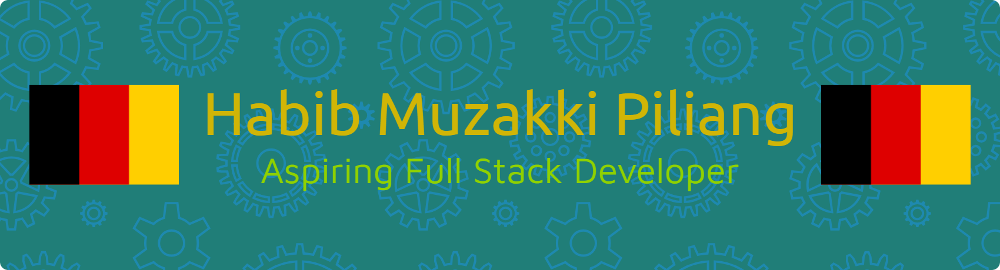

# **Hi there, I'm Habib Muzakki Piliang 👏👏👏👏👏👏👏**

***
 

# **👨🏻‍💻 My Main Project Portfolio (Project Portofolio Utama saya)**

 

- **Repo Website Awal (Portfolio)**: [Klik Repo Website Awal (Portfolio)](https://github.com/habibmuzakkipiliang/website_portofolio_awal)

- **Website Awal (Portfolio)**: [Klik https://habibmuzakkipiliang.github.io](https://habibmuzakkipiliang.github.io/website_portofolio_awal/)

- **Repo Website Portfolio Futuristik**: [Klik Repo Vercel 1](https://github.com/habibmuzakkipiliang/website_portofolio_baru_futuristik)

- **Website Portfolio Futuristik**: [Klik Vercel 1](https://website-portofolio-baru-futuristik.vercel.app/)

- **Repo Website Futuristik Baru V2**: [Klik Repo Vercel Baru 2](https://github.com/habibmuzakkipiliang/CODING_PORTOFOLIO_FUTURISTIK)

- **Website Futuristik Baru V2**: [Klik Vercel Baru 2](https://website-futuristik-versi-2-baru.vercel.app/)

***
 

# **📜Crafting Senior High School journeys and JKT48 fandom through code (Merajut kisah (SMA) dan dunia JKT48 lewat kode)**

 

## **NETLIFY DAN VERCEL**:

 

- **Daftar perjalanan selama Study Tour Bromo - Malang - Jogja Kelas 9 SMP, Semester 2 tahun 2023**: [KLIK DONG Study Tour Bromo - Malang - Jogja Kelas 9 SMP, Semester 2 tahun 2023](https://perjalanan-study-tour-smp-al-izzah-23.netlify.app/)

- **Website OSHIMEN WOTA JKT48**: [KLIK OSHIMEN WOTA JKT48](https://oshimen-wota-fans-oshi-jkt48.netlify.app/)

- **REPO DAFTAR VERSI ANDROID SMARTPHONE HP**: [KLIK DONG REPO DAFTAR VERSI ANDROID SMARTPHONE HP](https://github.com/habibmuzakkipiliang/Daftar_semua_versi_Android_Teknologi_Digital_HP)

- **WEBSITE DAFTAR VERSI ANDROID SMARTPHONE HP**: [KLIK DONG WEBSITE DAFTAR VERSI ANDROID SMARTPHONE HP](https://daftar-versi-android-teknologi-hp.vercel.app/)

- **PERANG DUNIA PERTAMA DAN KEDUA**: [KLIK DONG PERANG DUNIA PERTAMA DAN KEDUA](https://sejarah-perang-dunia-pertama-kedua.netlify.app/)

- **PESAWAT TEMPUR PERANG DUNIA KEDUA**: [KLIK DONG PESAWAT TEMPUR PERANG DUNIA KEDUA](https://pesawat-tempur-perang-dunia-kedua-2.netlify.app/)

- **Cerita pengalaman dan pejuang UTBK dan SNBT di Untirta Cilegon**: [KLIK DONG UNTUK PEJUAN UTBK UNTIRTA](https://cerita-pengalaman-pejuang-snbt-2026.netlify.app/)

- **Cerita pengalaman ujian praktek renang**:[KLIK DONG UJIAN PRAKTEK RENANG](https://cerita-pengalaman-renang-aqualand.netlify.app/)

- **Jadwal Ujian Praktek dan Tulis**: [KLIK DONG JADWAL PRAKTEK DAN TULIS](https://jadwal-ujian-sekolah-ujian-praktek.netlify.app/) 
 
- **Kenangan di MAN 2 KOTA SERANG**: [KLIK DONG KENANGAN SEKOLAH MAN 2 KOTA SERANG](https://kenangan-sekolah-man-2-kota-serang.netlify.app/)

- **Riwayat Pendidikan**: [KLIK DONG RIWAYAT PENDIDIKAN](https://riwayat-pendidikan-habib-muzakki.netlify.app/) 

- **KAUM HAWARIYYUN (12 MURID NABI ISA AS)**: [KLIK DONG KAUM HAWARIYYUN (12 MURID NABI ISA AS)](https://murid-nabi-isa-hawariyyun.netlify.app/)

***
 

# **👨🏻‍💻 My Projects and Coding Practice (Project saya dan Latihan Coding)**

 

## **Pas di SMA (MAN)** :
 

- **REPO WEBSITE FANDOM THE SMURFS 2021 SENDIRI**: [KLIK REPO WEBSITE FANDOM THE SMURFS 2021 SENDIRI](https://github.com/habibmuzakkipiliang/PROJECT_FANDOM_THE_SMURF_2021_SENDIRI)
 
- **WEBSITE FANDOM THE SMURFS 2021 SENDIRI**: [KLIK WEBSITE FANDOM THE SMURFS 2021 SENDIRI](https://website-fandom-the-smurfs-2021.netlify.app/)

- **REPO WEBSITE HEWAN YANG SUDAH PUNAH**: [KLIK REPO WEBSITE HEWAN YANG SUDAH PUNAH](https://github.com/habibmuzakkipiliang/A._HEWAN_PUNAH)

- **WEBSITE HEWAN YANG SUDAH PUNAH**: [KLIK WEBSITE HEWAN YANG SUDAH PUNAH](https://hewan-yang-sudah-punah-dalam-sejara.vercel.app/)

- **Repo LATIHAN HTML JAVASCRIPT DASAR 1**: [KLIK LATIHAN HTML JAVASCRIPT DASAR 1](https://github.com/habibmuzakkipiliang/1._LATIHAN_HTML_JAVASCRIPT_DASAR_1)

- **WEBSITE LATIHAN HTML JAVASCRIPT DASAR 1**: [KLIK WEBSITE LATIHAN HTML JAVASCRIPT DASAR 1](https://latihan-html-javascript-dasar-1.vercel.app/)

- **REPO LATIHAN WEBSITE HTML DASAR VERCEL**: [KLIK REPO LATIHAN WEBSITE HTML DASAR](https://github.com/habibmuzakkipiliang/1._LATIHAN_HTML_DASAR)

- **LATIHAN WEBSITE HTML DASAR VERCEL**: [KLIK WEBSITE HTML DASAR VERCEL](https://latihan-html-dasar.vercel.app/)

- **REPO LATIHAN BIKIN PROFIL SEDERHANA HTML VERCEL**: [KLIK REPO BIKIN PROFIL SEDERHANA](https://github.com/habibmuzakkipiliang/1._LATIHAN_BIKIN_PROFIL_SEDERHANA_HTML_VERCEL)

- **WEBSITE BIKIN PROFIL SEDERHANA HTML VERCEL**: [KLIK WEBSITE BIKIN PROFIL SEDERHANA HTML VERCEL](https://bikin-profil-sederhana-html.vercel.app/)

- **Formulir Contact Bootstrap**: [Klik Formulir Contact Bootstrap](https://habibmuzakkipiliang.github.io/website_portofolio_awal/Formulir_Contact_Bootstrap.html)

- **Web login dengan Bootstrap**: [Kllik Web login dengan Bootstrap](https://habibmuzakkipiliang.github.io/website_portofolio_awal/Formulir_Login_Bootstrap.html)

- **Formulir Pendaftaran Sederhana**: [Klik Formulir Pendaftaran Sederhana](https://habibmuzakkipiliang.github.io/website_portofolio_awal/Formulir_Pendaftaran_Sederhana.html)

- **Desain Website Awal Tes 1**: [Klik Desain Website Awal Tes 1](https://habibmuzakkipiliang.github.io/website_portofolio_awal/A._TES_BOOTSTRAP.html)

- **Desain Website Awal Tes 2**: [Klik Desain Website Awal Tes 2](https://habibmuzakkipiliang.github.io/website_portofolio_awal/A._Struktur_Bootstrap.html)

- **Desain Website Awal Tes 3**: [Klik Desain Website Awal Tes 3](https://habibmuzakkipiliang.github.io/website_portofolio_awal/A._TES_1.html)

- **Repo Website Tugas Prakarya 1**: [Klik Repo Website Tugas Prakarya](https://github.com/habibmuzakkipiliang/tugas_website_sendiri_khusus_prakarya)

- **Website Tugas Prakarya 1**: [Klik Website Tugas Prakarya](https://website-prakarya-habib-muzakki.vercel.app/)

- **Repo Website Tugas Prakarya 2**: [Klik Repo Website Tugas Prakarya 2](https://github.com/habibmuzakkipiliang/tugas_prakarya_makanan_daerah_indonesia)

- **Website Tugas Prakarya 2**: [Klik Website Tugas Prakarya 2](https://habib-muzakki-kelas-12-agama.vercel.app/)

- **Repo Landing Page**: [Klik Repo Vercel Landing Page](https://github.com/habibmuzakkipiliang/landing_page_awal)

- **Website Landing Page**: [Klik Vercel Landing Page](https://landing-page-awal-habib.vercel.app/)
 
- **Belajar Coding Try (JS, Python dan HTML)**: [Klik Belajar Coding Try](https://github.com/habibmuzakkipiliang/BELAJAR_CODING_TRY)

- **Repo Latihan JavaScript Sederhana 2**: [Klik Latihan JavaScript Sederhana 2*](https://github.com/habibmuzakkipiliang/Latihan_JavaScript_Sederhana)

- **Repo Latihan Python Sederhana 2**: [Klik Latihan Python Sederhan 2](https://github.com/habibmuzakkipiliang/Latihan_Python_Sederhana)

- **Repo Mini Project Python (Aplikasi Kalkulator)**: [Klik Mini Project Python](https://github.com/habibmuzakkipiliang/Mini_Project_Sederhana_Python)

- **Repo Mini Project JavaScript (Aplikasi Kalkulator)**: [Klik Mini Project JavaScript](https://github.com/habibmuzakkipiliang/Mini_Project_Sederhana_JavaScript)

- **Laporan OWASP ZAP CyberSecurity, Hacking, Hacker**: [Klik Laporan OWASP ZAP CyberSecurity Hacking](https://github.com/habibmuzakkipiliang/Laporan_OWASP_ZAP_CyberSecurity_Hacker_Hacking_Bug_Hunter_Bug_Bounty)

* * *
 

# **🎖️ Certificates and Award Charters (Sertifikat dan Piagam Penghargaan)**: 

 

## **Pas di SMA (MAN)** :
 

- Piagam Penghargaan Medali Emas : RSCI (Ramadhan Science Competition Indonesia) Informatika 2025

- Piagam Penghargaan Medali Perak : IOS (Indonesia Olympiad of Indonesia) Informatika 2025

- Piagam Penghargaan Medali Perunggu : SSO (Superstar Science Olympiad) Informatika 2025

- Piagam Penghargaan Finalis OSN-K Informatika tahun 2025

- Sertifikat Kompetensi Special Skill Indonesia Bootcamp IT Pemrograman Python tahun 2026

- Sertifikat Kompetensi Special Skill Indonesia Bootcamp IT Pemrograman Python 2 tahun 2026

- EXCELLENT GRADE Kickstart Fullstack Web Development Journey by Rakamin Academy Bootcamp IT tahun 2024

- CERTIFICATE OF PARTICIPATION Kickstart Fullstack Web Development Journey by Rakamin Academy Bootcamp IT tahun 2024

- Sertifikat Kehadiran : Bali Project Indonesia Webinar "Ngoding di Era Al: Dasar Al untuk Software Developer Pemula" tahun 2026

- Sertifikat Kehadiran : Bali Project Indonesia Webinar : Webinar "Software Development Chapter: Dasar Frontend dan Backend Untuk Pemula" tahun 2026

- Sertifikat CyberSecurity : Introduction to Information Security Course oleh Cyber Academy 2025

- Sertifikat LULUS pelatihan Penggunaan Tools Artificial Intilegence untuk
Kesiapan Kerja dan Karir oleh KEMENTERIAN KETENAGAKERJAAN REPUBLIK INDONESIA tahun 2026

- Sertifikat LULUS pelatihan Penggunaan Tools Artificial Intilegence yaitu Daftar Unit Kompetensi yang Dicapai untuk Kesiapan Kerja dan Karir oleh KEMENTERIAN KETENAGAKERJAAN REPUBLIK INDONESIA tahun 2026

- Sertifikat DQLab Bootcamp IT : Introduction to Data Science with Python tahun 2025

- Sertifikat DQLab Bootcamp IT : Mini Bootcamp: Introduction to Data Analytics Batch 4 tahun 2025

- Sertifikat DQLab Bootcamp IT : Study Case Bootcamp Data Analyst with SQL & Python tahun 2025

- Sertifikat DQLab Bootcamp IT : Guide to Learn Python with Al at DQLab tahun 2025

- Sertifikat DQLab Bootcamp IT : Introduction to Data Science with Python tahun 2025

- Sertifikat DQLab Bootcamp IT : Study Case Bootcamp Data Analyst with Excel tahun 2025
 
- Sertifikat DQLab Bootcamp IT : Study Case Bootcamp Machine learning & Al for Beginner tahun 2025

- Sertifikat SmartPath Finance and Accounting Webinar
"Data Processing and Visualization" by SmartPath Bootcamp tahun 2025

- Sertifikat IDCamp x Dicoding Live #10 - UiPath Agentic Automation: Introduction
and Use Case tahun 2025

- Sertifikat completing Module 2: Creating Essay Outlines
and Drafts with AI - Ethics and Best Practices on November 23,
2024 by Cakapriset

- Sertifikat completing Essay Mastery Class: Framework and Strategy to
Win Research Competitions on 18-21 November 2024, By Cakapriset

- Sertifikat completing Module 1: Developing Ideas and Designing Competition
Titles with AI – Ethics and Best Practices on November 22, 2024, By Cakapriset

* * *
 

# **ℹ️ About Me (In English)**:

 

✅ Alumni of MAN 2 Serang City (Graduated 2026) 

✅ Alumni of Class 12 Religion (Graduated 2026) 

✅ 34th Class of ASCENDRIA MAN 2 SERANG CITY 

✅ OSN-S Informatics (2025) *Completed and passed* 

✅ OSN-K Informatics (2025) *Completed and only reached the city level* 

✅ Part of Generation Z (Gen Z)

✅ Former school status: from 2025 to 2026 (April 15th) it was PP (round trip) from home, no longer living in boarding school (dormitory) after 2 years (2023 - 2025) of living in the dormitory.

✅ Enjoys Computer Science and Social Studies 

✅ Native Minangkabau-Piliang 

✅ Migrant from West Sumatra 

✅ A novice novelist (novel writer) on Wattpad 

✅ A blogger on Blogspot and Kompasiana 

✅ Media and Fashion Committee (Event Documentation *Completed*)
  ABG (Happy Boarding Arena) Event *Completed*
  MAN 2 Kota Serang – 2025 

✅ Aspiring Front End Developer 

✅ Aspiring Full Stack Developer 

✅ Aspiring Web Developer

* * *
 

# **ℹ️ Tentang Saya (In Indonesia)**:

 

✅ Alumni MAN 2 Kota Serang (Lulus 2026)  

✅ Alumni Kelas 12 Agama (Lulus 2026)  

✅ Angkatan ke-34 ASCENDRIA MAN 2 KOTA SERANG  

✅ OSN-S Informatika (2025) *Telah selesai dan lolos*  

✅ OSN-K Informatika (2025) *Telah Selesai dilaksanakan dan hanya sampai tingkat kota saja*  

✅ Bagian dari Generasi Z (Gen Z)

✅ Status sekolah dulu : saat di tahun 2025 hingga 2026 (15 april) adalah PP (pulang-pergi) dari rumah, tidak lagi tinggal di boarding school (asrama) setelah 2 tahun (2023 - 2025) menetap di asrama. 

✅ Menyukai mapel Informatika (Komputer) dan IPS  

✅ Orang Asli Minangkabau-Piliang  

✅ Perantau dari Sumatra Barat  

✅ Seorang Novelis (Penulis Novel) pemula di Wattpad  

✅ Seorang Blogger di Blogspot dan Kompasiana  

✅ Panitia Media and Fashion (Dokumentasi Acara *Selesai dilaksanakan*
  Acara ABG (Arena Boarding Gembira) *Selesai dilaksanakan*
  MAN 2 Kota Serang – Tahun 2025  

✅ Calon Front End Developer  

✅ Calon Full Stack Developer  

✅ Calon Web Developer

* * *
 

# **</> Programming language (Coding) currently being studied (Full Stack Developer)** :

 

→ **Main for Front End and Back End (Required):**

✅ HTML (HyperText Markup Language)

✅ CSS (Cascading Style Sheets)

✅ Bootstrap (CSS Framework)

✅ Basic JavaScript (Front End Web)

✅ Basic Python (Basic Programming, Back End Web, AI, and Machine Learning)

* * *

→ **Only the basics of programming and logic and are not mandatory to learn ::**

✅ Basic C++ (Specifically for the 2025 Informatics OSN-K and basic coding logic.

* * *
 

# **</> Bahasa pemrograman (Coding) yang saat ini sedang dipelajari (Full Stack Developer)**:

 

→ **Utama untuk Front End dan Back End (Wajib) :**

✅ HTML (HyperText Markup Language)

✅ CSS (Cascading Style Sheets)

✅ Bootstrap (Framework CSS)

✅ JavaScript dasar (Front End Web)

✅ Python dasar (Dasar Pemrograman, Back End Web, AI, dan Machine Learning)

* * *

→ **Hanya dasar logika saja dan tidak wajib dipelajari :**

✅ C++ dasar (Khusus untuk OSN-K Informatika 2025 dan logika coding dasar.)

* * *
 

# **🤖 AI Agentic IDE Coding (AI Agentic IDE Coding):**

***
 

# **💻 Programming Language Coding (Bahasa Pemrograman atau Coding):**

 
 

* * *
 

# **⚙️ Tools (Alat)**:

***
 

# **🌐 Media Social:**

 

* * *
 

# 📊 GitHub Stats:
 
 

* * *
 

## 🏆 GitHub Trophies

* * *
 

### ✍️ Random Dev Quote

* * *
 

### 🔝 Top Contributed Repo

* * *
 

<!-- Proudly created with GPRM ( https://gprm.itsvg.in ) -->

* * *
 

# **📑 Artikel:**

- **Blog**: [habibmuzakkipiliang.blogspot.com](https://habibmuzakkipiliang.blogspot.com/)

- **Kompasiana**: [habib muzakki blogger](https://www.kompasiana.com/habibmuzakki3305)

- **Profil di Wattpad**: [habib muzakki piliang](https://www.wattpad.com/user/habib_muzakki)

- **Karya Novel di Wattpad**: [Ghost Love in the Code: Cinta Antara Bug dan Doa](https://www.wattpad.com/story/395495837-ghost-love-in-the-code-cinta-antara-bug-dan-doa?utm_source=android&utm_medium=link&utm_content=story_info&wp_page=story_details_button&wp_uname=habib_muzakki)

- **Karya Novel di Wattpad**: [Ghost Love in Java](https://www.wattpad.com/story/395648296-ghost-love-in-java?utm_source=android&utm_medium=link&utm_content=story_info&wp_page=story_details_button&wp_uname=habib_muzakki)

- **Karya Novel di Wattpad**: [Ghost Love in Java : The Sequel - Cinta di Dunia](https://www.wattpad.com/story/395760661-ghost-love-in-java-the-sequel-cinta-di-dunia)

- **Karya Novel di Wattpad**: [Cinta di Bawah Langit Menteng: Habib Muzakki & Hantu Noni Belanda Cathy](https://www.wattpad.com/story/395895687-cinta-di-bawah-langit-menteng-habib-muzakki-hantu) 

- **Karya Novel di Wattpad**: [Cinta Gak Harus Jadian: True Love Ala OSN](https://www.wattpad.com/story/397162907-cinta-gak-harus-jadian-true-love-ala-osn) 

- **Karya Novel di Wattpad**: [MINECRAFT: THE JAVA EXORCIST - KUTUKAN KODE HITAM](https://www.wattpad.com/story/407318949-minecraft-the-java-exorcist-kutukan-kode-hitam) 

* * *
 

# **🎵 My Personal Hobbies & JKT48 Oshi List**

**Idol Enthusiast (Wota and Fans)**
-------------------------------

**Favorite Idol Group: JKT48 | AKB48 | Hearts2Hearts (H2H) | Rain Tree**
--------------------------------------------------------------------

**Oshi (Favorite Member) below:**

1\. Gracie JKT48 (MAIN) 

2\. Michie JKT48 (MAIN)

3\. Lily JKT48 (MAIN)

4\. Aralie JKT48 (MAIN)

5\. Fritzy JKT48 (MAIN)

6\. Lana JKT48 (MAIN)

7\. Anindya JKT48 (MAIN)

8\. Christy JKT48 (MAIN)

9\. Celine Ex JKT48 (MAIN)

10\. Carmen Hearts2Hearts (H2H) (MAIN)

11\. Freya JKT48 (MAIN)

12\. Olla JKT48

13\. Jessi JKT48

14\. Fiony JKT48

15\. Muthe JKT48

16\. Marsha JKT48

17\. Eli JKT48

18\. Mikaela JKT48 (Mikaela Kusjanto)

19\. Ekin JKT48 (Jacqueline Immanuela Jonathan)

20\. Intan JKT48 (Nur Intan)

21\. Yui Oguri (AKB48)

22\. Endo Rino (Rain Tree)

* * *
 

# **🎵 Hobi Personal Saya & Daftar Oshi JKT48**

**Idol Enthusiast (Wota dan Fans)**
-----------------------------------

**Grup Idol Favorit: JKT48 | AKB48 | Hearts2Hearts (H2H) | Rain Tree**
----------------------------------------------------------------------

**Oshi (Member Favorit) dibawah ini  :**

1\. Gracie JKT48 (UTAMA)

2\. Michie JKT48 (UTAMA)

3\. Lily JKT48 (UTAMA)

4\. Aralie JKT48 (UTAMA)

5\. Fritzy JKT48 (UTAMA)

6\. Lana JKT48 (UTAMA)

7\. Anindya JKT48 (UTAMA)

8\. Christy JKT48 (UTAMA)

9\. Celine Eks JKT48 (UTAMA)

10\. Carmen Hearts2Hearts (H2H) (UTAMA)

11\. Freya JKT48 (UTAMA)

12\. Olla JKT48

13\. Jessi JKT48

14\. Fiony JKT48

15\. Muthe JKT48

16\. Marsha JKT48

17\. Eli JKT48

18\. Mikaela JKT48 (Mikaela Kusjanto)

19\. Ekin JKT48 (Jacqueline Immanuela Jonathan)

20\. Intan JKT48 (Nur Intan)

21\. Yui Oguri (AKB48)

22\. Endo Rino (Rain Tree)

* * *
