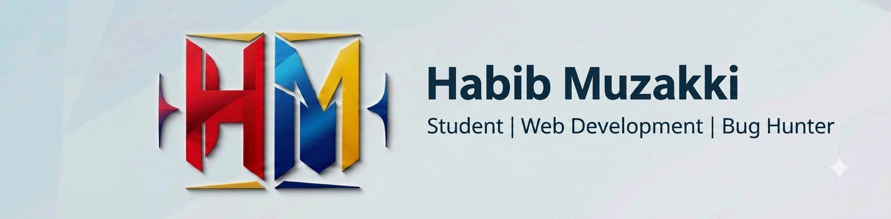

# **Hi there, I'm Habib Muzakki Piliang 👏👏👏👏**

***
 

***
 

# **📜 Portfolio Web Historical / Portofolio Web Sejarah**

 

- **MARAWA — Bendera Pusaka & Identitas Abadi Orang Minang (Orang Padang) dari Dulu hingga Sekarang** : [KLIK MARAWA — Bendera Pusaka & Identitas Abadi Orang Minang (Orang Padang) dari Dulu hingga Sekarang](https://sejarah-bendera-marawa-minangkabau.netlify.app/)

- **🏔️ Di Kaki Gunung Pangrango: Kisah Tersembunyi 10 Makam Tentara Jerman di Bogor — Mengapa Mereka Ada, Siapa Mereka, dan Mengapa Sedikit Orang Tahu?**: [KLIK Di Kaki Gunung Pangrango: Kisah Tersembunyi 10 Makam Tentara Jerman di Bogor — Mengapa Mereka Ada, Siapa Mereka, dan Mengapa Sedikit Orang Tahu?](https://sejarah-makam-jerman-bogor-jawa-barat.netlify.app/)

- **👑 JELAJAH SEJARAH KESULTANAN BANTEN LAMA & KOTA KUNO: Dari Kejayaan Sultan, Arsitek Etnis Tionghoa, hingga Jejak Pecinan yang Terlupakan**: [KLIK JELAJAH SEJARAH KESULTANAN BANTEN LAMA & KOTA KUNO: Dari Kejayaan Sultan, Arsitek Etnis Tionghoa, hingga Jejak Pecinan yang Terlupakan](https://sejarah-banten-lama-cina-tionghoa.netlify.app/)

- **Misteri & Sejarah Dinasti Tuan Tanah Van Motman: Dari Kejayaan Kolonial Hingga Reruntuhan Mausoleum Bogor**: [KLIK Misteri & Sejarah Dinasti Tuan Tanah Van Motman: Dari Kejayaan Kolonial Hingga Reruntuhan Mausoleum Bogor](https://sejarah-mausoleum-van-motman-bogor.netlify.app/)

- **Sejarah Kedatangan Tionghoa (Chindo - Cina) ke Indonesia**: [KLIK Sejarah Kedatangan Tionghoa (Chindo) ke Indonesia](https://sejarah-kedatangan-cina-ke-indonesia.netlify.app/)

- **Laksamana Cheng Ho: Sang Penjelajah Laut Terbesar yang Membawa Damai dan Persahabatan ke Nusantara**: [KLIK Laksamana Cheng Ho: Sang Penjelajah Laut Terbesar yang Membawa Damai dan Persahabatan ke Nusantara](https://sejarah-cheng-ho-ming-cina-tiongkok.netlify.app/)

- **Mengenal VOC: Perusahaan Terkaya Sepanjang Sejarah Dunia yang Punya Tentara Sendiri**: [KLIK Mengenal VOC: Perusahaan Terkaya Sepanjang Sejarah Dunia yang Punya Tentara Sendiri](https://sejarah-voc-hindia-belanda-indonesia.netlify.app/)

- **Panduan Lengkap Sejarah Imperium Britania Raya (Inggris), EIC, dan Jejaknya di Nusantara**: [KLIK Panduan Lengkap Sejarah Imperium Britania Raya (Inggris), EIC, dan Jejaknya di Nusantara](https://sejarah-eic-inggris-britania-raya.netlify.app/)

- **Sejarah Tanam Paksa di Indonesia**: [KLIK Sejarah Tanam Paksa di Indonesia](https://sejarah-tanam-paksa-belanda-indonesia.netlify.app/)

- **Sejarah Lubang Jepang Bukittinggi, Sumatra Barat**: [KLIK Sejarah Lubang Jepang Bukittinggi, Sumatra Barat](https://sejarah-lubang-jepang-bukittinggi.netlify.app/)

- **4 Wanita Cantik di Zaman Tiongkok (Cina) Kuno**: [KLIK 4 Wanita Cantik di Zaman Tiongkok Kuno](https://4-wanita-cantik-zaman-cina-kuno.netlify.app/)

- **Sejarah Dinasti dan Era Tiongkok (Cina)**: [KLIK Sejarah Dinasti dan Era Tiongkok (Cina)](https://sejarah-dinasti-dan-era-tiongkok-cina.netlify.app/)

- **Karakter Game Seri Dynasty Warriors (Kisah Tiga Negara Samkok)**: [KLIK Karakter Game Seri Dynasty Warriors (Kisah Tiga Negara Samkok)](https://karakter-game-seri-dynasty-warriors.netlify.app/)

- **PERANG DUNIA PERTAMA DAN KEDUA**: [KLIK DONG PERANG DUNIA PERTAMA DAN KEDUA](https://sejarah-perang-dunia-pertama-kedua.netlify.app/)

- **PESAWAT TEMPUR PERANG DUNIA KEDUA**: [KLIK DONG PESAWAT TEMPUR PERANG DUNIA KEDUA](https://pesawat-tempur-perang-dunia-kedua-2.netlify.app/)

***
 

# **👨🏻‍💻 My Main Project Portfolio (Project Portofolio Utama saya)**

 

- **Website Portofolio tentang yang OSHI DAN FANS JKT48**: [KLIK Website Portofolio tentang oshi dan fans JKT48](https://website-portofolio-fans-jkt48.netlify.app/)

- **Laporan OWASP ZAP Bug Hunter**: [Klik Laporan OWASP ZAP Bug Hunter](https://github.com/habibmuzakkipiliang/Laporan_OWASP_ZAP_CyberSecurity_Hacker_Hacking_Bug_Hunter_Bug_Bounty)

- **WEBSITE DAFTAR VERSI ANDROID SMARTPHONE HP**: [KLIK DONG WEBSITE DAFTAR VERSI ANDROID SMARTPHONE HP](https://daftar-versi-android-teknologi-hp.vercel.app/)

- **WEBSITE FANDOM THE SMURFS 2021 SENDIRI**: [KLIK WEBSITE FANDOM THE SMURFS 2021 SENDIRI](https://website-fandom-the-smurfs-2021.netlify.app/)

- **Website Awal (Portfolio)**: [Klik https://habibmuzakkipiliang.github.io](https://habibmuzakkipiliang.github.io/website_portofolio_awal/)

- **Website Portfolio Futuristik**: [Klik Vercel 1](https://website-portofolio-baru-futuristik.vercel.app/)

- **Website Futuristik Baru V2**: [Klik Vercel Baru 2](https://website-futuristik-versi-2-baru.vercel.app/)

- **Extension VS Code Coding Modern 2026**: [KLIK Extension VS Code Coding Modern 2026](https://extension-vs-code-coding-modern-2026.netlify.app/)
 

***
 

# **🎖️ Certificates and Award Charters (Sertifikat dan Piagam Penghargaan)**: 

 

## **Pas di SMA (MAN)** :

✅ **Cek Semua Sertifikat nya disini** : [KLIK Cek Semua Sertifikat nya disini](https://github.com/habibmuzakkipiliang/SERTIFIKAT_RESMI_LEGAL_DAN_BERIZIN)

1\. Piagam Penghargaan Medali Emas : <a href="https://www.instagram.com/p/DVNM7k6k1W8/">RSCI (Ramadhan Science Competition Indonesia)</a> Informatika 2025

2\. Piagam Penghargaan Medali Perak : <a href="https://www.instagram.com/p/DS9sS0QDzT-/">IOS (Indonesia Olympiad of Indonesia)</a> Informatika 2025

3\. Piagam Penghargaan Medali Perunggu : <a href="https://daftar-sso.manbatam.sch.id/">SSO (Superstar Science Olympiad) MAN BATAM</a> Informatika 2025

4\. Piagam Penghargaan <a href="https://osn-onmipa-bpti.kemendikdasmen.go.id/osn.html">Finalis OSN-K Informatika tahun 2025</a>

5\. Sertifikat Kompetensi <a href="https://specialskill.id/">Special Skill Indonesia</a> Bootcamp IT Pemrograman dasar Python tahun 2026

6\. Sertifikat Kompetensi <a href="https://specialskill.id/">Special Skill Indonesia</a> Bootcamp IT Pemrograman dasar Python 2 (tabel data hasil materi dan nilainya) tahun 2026

7\. SERTIFIKAT KURSUS <a href="https://skillpedia.id/">SKILLPEDIA.ID</a> KELAS WEB DEVELOPMENT (HTML, CSS, JS) SECARA DARING TAHUN 2026

8\. EXCELLENT GRADE Kickstart Fullstack Web Development Journey by <a href="https://app.rakamin.com/academy">Rakamin Academy</a>  Bootcamp IT tahun 2024

9\. CERTIFICATE OF PARTICIPATION Kickstart Fullstack Web Development Journey by <a href="https://app.rakamin.com/academy">Rakamin Academy</a> Bootcamp IT tahun 2024

10\. Sertifikat Kehadiran : <a href="https://baliproject.co.id/">Bali Project Indonesia</a> Webinar "Ngoding di Era Al: Dasar Al untuk Software Developer Pemula" tahun 2026

11\. Sertifikat Kehadiran : <a href="https://baliproject.co.id/">Bali Project Indonesia</a> Webinar : Webinar "Software Development Chapter: Dasar Frontend dan Backend Untuk Pemula" tahun 2026

12\. Sertifikat CyberSecurity : Introduction to Information Security Course oleh <a href="https://www.cyberacademy.id/">Cyber Academy Indonesia</a> 2025

13\. Sertifikat LULUS pelatihan Penggunaan Tools Artificial Intilegence untuk
Kesiapan Kerja dan Karir oleh KEMENTERIAN KETENAGAKERJAAN REPUBLIK INDONESIA tahun 2026

14\. Sertifikat LULUS pelatihan Penggunaan Tools Artificial Intilegence yaitu Daftar Unit Kompetensi yang Dicapai untuk Kesiapan Kerja dan Karir oleh KEMENTERIAN KETENAGAKERJAAN REPUBLIK INDONESIA tahun 2026

15\. Sertifikat <a href="https://dqlab.id/">DQLab Bootcamp IT</a> : Introduction to Data Science with Python tahun 2025 (DASAR)

16\. Sertifikat <a href="https://dqlab.id/">DQLab Bootcamp IT</a> : Mini Bootcamp: Introduction to Data Analytics Batch 4 tahun 2025 (DASAR)

17\. Sertifikat <a href="https://dqlab.id/">DQLab Bootcamp IT</a> : Study Case Bootcamp Data Analyst with SQL & Python tahun 2025 (DASAR)

18\. Sertifikat <a href="https://dqlab.id/">DQLab Bootcamp IT</a>  : Guide to Learn Python with Al at DQLab tahun 2025 (DASAR)

19\. Sertifikat <a href="https://dqlab.id/">DQLab Bootcamp IT</a>  : Study Case Bootcamp Data Analyst with Excel tahun 2025 (DASAR)
 
20\. Sertifikat <a href="https://dqlab.id/">DQLab Bootcamp IT</a>  : Study Case Bootcamp Machine learning & Al for Beginner tahun 2025 (DASAR)

21\. Sertifikat SmartPath Finance and Accounting Webinar
"Data Processing and Visualization" by <a href="https://smartpath.id/">SmartPath Bootcamp</a> tahun 2025 (DASAR)

22\. Sertifikat IDCamp x Dicoding Live #10 - UiPath Agentic Automation: Introduction
and Use Case tahun 2025 (DASAR)

23\. Sertifikat completing Module 2: Creating Essay Outlines
and Drafts with AI - Ethics and Best Practices on November 23,
2024 by Cakapriset

24\. Sertifikat completing Essay Mastery Class: Framework and Strategy to
Win Research Competitions on 18-21 November 2024, By Cakapriset

25\. Sertifikat completing Module 1: Developing Ideas and Designing Competition
Titles with AI – Ethics and Best Practices on November 22, 2024, By Cakapriset

* * *
 

# **💻 Programming Language Coding (Bahasa Pemrograman atau Coding):**

 

 

 

 

 

*  *  *
 

# **🤖 AI Agentic IDE Coding Tools (AI Driver Coding Tools):**

* * *
 

# **🕵 Aspiring Bug Hunter (Bug Hunter OWASP ZAP Tools)** :

* * *
 

# **⚙️ Tools (Alat)**:

* * *
 

# **🌐 Media Social:**

 

 

* * *
 

# 📊 GitHub Stats:
 

 

* * *
 

## 🏆 GitHub Trophies

* * *
 

### ✍️ Random Dev Quote

* * *
 

### 🔝 Top Contributed Repo

* * *
 

# **ℹ️ About Me (In English)**:

 

✅ **Harkat Negeri University of Tegal, Center Java**

✅ **D4 Vocational Informatics Engineering**

✅ **I prefer hands-on coding practice over rigid, boring academic theory.**

✅ **Able to control and use simple AI agentic coding tools**

✅ **Year of Birth : 2007 (Gen Z Core)**

✅ **Domicile (place of residence) : Serang City, Banten Province, Indonesia**

✅ **Alumnus of MAN 2 Serang City (Graduating in 2026)** 

✅ **Alumnus of the Religious Studies Stream (Grades 10–12) (Graduating in 2026)** 

✅ **34th Cohort of ASCENDRIA MAN 2 Serang City (Graduating in 2026)** 

✅ **OSN-S Informatics (2025) *Completed and passed*** 

✅ **OSN-K Informatics (2025) *Completed and only reached the city level*** 

✅ **Part of Generation Z (Gen Z Core)**

✅ **School status (2023–2026): From 2025 to 2026 (with schooling ending on April 15, 2026), the student is officially a day student commuting from home, having ceased living in the boarding facility after two years (2023–2025) of residence at the MAN 2 Kota Serang dormitory.**

✅ Enjoys Computer Science and Social Studies 

✅ Native Minangkabau-Piliang 

✅ Migrant from West Sumatra 

✅ **Idol Enthusiast (Wota and Fans) JKT48** 

✅ A Beginner from 0 Novelist (Novel Writer) on Wattpad 

✅ A Beginner from 0 Bloggers on Blogspot and Kompasiana 

✅ A Beginner from 0 Bug Hunter (Bug Bounty) OWASP ZAP 

✅ Media and Fashion Committee (Event Documentation *Completed*)
  ABG (Happy Boarding Arena) Event *Completed*
  MAN 2 Kota Serang – 2025 

✅ **Aspiring Front End Developer** 

✅ **Aspiring Full Stack Developer** 

✅ **Aspiring Web Developer** 

* * *
 

# **ℹ️ Tentang Saya (In Indonesia)**:

 

✅ **Universitas Harkat Negeri Tegal, Jawa Tengah**

✅ **D4 Vokasi Teknik Informatika**

✅ **lebih suka praktek Coding secara aplikatif daripada teori akademisi kaku yang bosenin**

✅ **Bisa mengendalikan dan menggunakan AI Agentic Coding Tools yang sederhana dan simpel**

✅ **Tahun Lahir : 2007 (Gen Z Inti)**

✅ **Domisili (tempat tinggal) : Kota Serang, Provinsi Banten, Indonesia**

✅ **Alumni MAN 2 Kota Serang (Lulus di tahun 2026)**  

✅ **Alumni Jurusan Agama (Dari Kelas 10 sampai kelas 12 Agama) (Lulus di tahun 2026)**  

✅ **Angkatan ke-34 ASCENDRIA MAN 2 KOTA SERANG (Lulus di tahun 2026)**  

✅ **OSN-S Informatika (2025) *Telah selesai dan lolos***  

✅ **OSN-K Informatika (2025) *Telah Selesai dilaksanakan dan hanya sampai tingkat kota saja***  

✅ **Bagian dari Generasi Z (Gen Z Inti)**

✅ **Status sekolah dulu (2023 - 2026) : saat di tahun 2025 hingga 2026 (akhir sekolah pada 15 april 2026) adalah sebagai Anak PP (pulang pergi) yang legal dari rumah, dan tidak lagi tinggal di boarding school (asrama) setelah 2 tahun (2023 - 2025) menetap di asrama MAN 2 KOTA SERANG**. 

✅ Menyukai mapel Informatika (Komputer) dan IPS  

✅ Orang Asli Minangkabau-Piliang  

✅ Perantau dari Sumatra Barat  

✅ **Idol Enthusiast (Wota and Fans) JKT48** 

✅ Seorang Pemula dari 0 Novelis (Penulis Novel) di Wattpad  

✅ Seorang Pemula dari 0 Blogger di Blogspot dan Kompasiana  

✅ Seorang Pemula dari 0 Bug Hunter (Bug Bounty) OWASP ZAP 

✅ Panitia Media and Fashion (Dokumentasi Acara *Selesai dilaksanakan*
  Acara ABG (Arena Boarding Gembira) *Selesai dilaksanakan*
  MAN 2 Kota Serang – Tahun 2025  

✅ **Calon Front End Developer**  

✅ **Calon Full Stack Developer**  

✅ **Calon Web Developer** 

* * *
 

# **</> Programming language (Coding) currently being studied (Full Stack Developer)** :

 

→ **Main for Front End and Back End (Required):**

✅ HTML (HyperText Markup Language)

✅ CSS (Cascading Style Sheets)

✅ Bootstrap (CSS Framework)

✅ Basic JavaScript (Front End Web)

✅ Basic Python (Basic Programming, Back End Web, AI, and Machine Learning)

* * *

→ **Only the basics of programming and logic and are not mandatory to learn ::**

✅ Basic C++ (Specifically for the 2025 Informatics OSN-K and basic coding logic.

* * *
 

# **</> Bahasa pemrograman (Coding) yang saat ini sedang dipelajari (Full Stack Developer)**:

 

→ **Utama untuk Front End dan Back End (Wajib) :**

✅ HTML (HyperText Markup Language)

✅ CSS (Cascading Style Sheets)

✅ Bootstrap (Framework CSS)

✅ JavaScript dasar (Front End Web)

✅ Python dasar (Dasar Pemrograman, Back End Web, AI, dan Machine Learning)

* * *

→ **Hanya dasar logika saja dan tidak wajib dipelajari :**

✅ C++ dasar (Khusus untuk OSN-K Informatika 2025 dan logika coding dasar.)

* * *
 

# **📁 Repository Github Only** :

 

- **Repo Website Awal (Portfolio)**: [Klik Repo Website Awal (Portfolio)](https://github.com/habibmuzakkipiliang/website_portofolio_awal)

- **Repo Website Portfolio Futuristik**: [Klik Repo Vercel 1](https://github.com/habibmuzakkipiliang/website_portofolio_baru_futuristik)

- **Repo Website Futuristik Baru V2**: [Klik Repo Vercel Baru 2](https://github.com/habibmuzakkipiliang/CODING_PORTOFOLIO_FUTURISTIK)

- **REPO DAFTAR VERSI ANDROID SMARTPHONE HP**: [KLIK DONG REPO DAFTAR VERSI ANDROID SMARTPHONE HP](https://github.com/habibmuzakkipiliang/Daftar_semua_versi_Android_Teknologi_Digital_HP)

- **REPO WEBSITE FANDOM THE SMURFS 2021 SENDIRI**: [KLIK REPO WEBSITE FANDOM THE SMURFS 2021 SENDIRI](https://github.com/habibmuzakkipiliang/PROJECT_FANDOM_THE_SMURF_2021_SENDIRI)

- **REPO WEBSITE HEWAN YANG SUDAH PUNAH**: [KLIK REPO WEBSITE HEWAN YANG SUDAH PUNAH](https://github.com/habibmuzakkipiliang/A._HEWAN_PUNAH)

- **Repo LATIHAN HTML JAVASCRIPT DASAR 1**: [KLIK LATIHAN HTML JAVASCRIPT DASAR 1](https://github.com/habibmuzakkipiliang/1._LATIHAN_HTML_JAVASCRIPT_DASAR_1)

- **REPO LATIHAN WEBSITE HTML DASAR VERCEL**: [KLIK REPO LATIHAN WEBSITE HTML DASAR](https://github.com/habibmuzakkipiliang/1._LATIHAN_HTML_DASAR)

- **REPO LATIHAN BIKIN PROFIL SEDERHANA HTML VERCEL**: [KLIK REPO BIKIN PROFIL SEDERHANA](https://github.com/habibmuzakkipiliang/1._LATIHAN_BIKIN_PROFIL_SEDERHANA_HTML_VERCEL)

- **Repo Website Tugas Prakarya 1**: [Klik Repo Website Tugas Prakarya](https://github.com/habibmuzakkipiliang/tugas_website_sendiri_khusus_prakarya)

- **Repo Website Tugas Prakarya 2**: [Klik Repo Website Tugas Prakarya 2](https://github.com/habibmuzakkipiliang/tugas_prakarya_makanan_daerah_indonesia)

- **Repo Landing Page**: [Klik Repo Vercel Landing Page](https://github.com/habibmuzakkipiliang/landing_page_awal)

- **Repo Latihan JavaScript Sederhana 2**: [Klik Latihan JavaScript Sederhana 2*](https://github.com/habibmuzakkipiliang/Latihan_JavaScript_Sederhana)

- **Repo Latihan Python Sederhana 2**: [Klik Latihan Python Sederhan 2](https://github.com/habibmuzakkipiliang/Latihan_Python_Sederhana)

- **Repo Mini Project Python (Aplikasi Kalkulator)**: [Klik Mini Project Python](https://github.com/habibmuzakkipiliang/Mini_Project_Sederhana_Python)

- **Repo Mini Project JavaScript (Aplikasi Kalkulator)**: [Klik Mini Project JavaScript](https://github.com/habibmuzakkipiliang/Mini_Project_Sederhana_JavaScript)

* * *
 

# **👨🏻‍💻 My Projects and Coding Practice (Project saya dan Latihan Coding)**

 

## **Pas di SMA (MAN)** :
 

- **WEBSITE HEWAN YANG SUDAH PUNAH**: [KLIK WEBSITE HEWAN YANG SUDAH PUNAH](https://hewan-yang-sudah-punah-dalam-sejara.vercel.app/)

- **WEBSITE LATIHAN HTML JAVASCRIPT DASAR 1**: [KLIK WEBSITE LATIHAN HTML JAVASCRIPT DASAR 1](https://latihan-html-javascript-dasar-1.vercel.app/)

- **LATIHAN WEBSITE HTML DASAR VERCEL**: [KLIK WEBSITE HTML DASAR VERCEL](https://latihan-html-dasar.vercel.app/)

- **WEBSITE BIKIN PROFIL SEDERHANA HTML VERCEL**: [KLIK WEBSITE BIKIN PROFIL SEDERHANA HTML VERCEL](https://bikin-profil-sederhana-html.vercel.app/)

- **Formulir Contact Bootstrap**: [Klik Formulir Contact Bootstrap](https://habibmuzakkipiliang.github.io/website_portofolio_awal/Formulir_Contact_Bootstrap.html)

- **Web login dengan Bootstrap**: [Kllik Web login dengan Bootstrap](https://habibmuzakkipiliang.github.io/website_portofolio_awal/Formulir_Login_Bootstrap.html)

- **Formulir Pendaftaran Sederhana**: [Klik Formulir Pendaftaran Sederhana](https://habibmuzakkipiliang.github.io/website_portofolio_awal/Formulir_Pendaftaran_Sederhana.html)

- **Desain Website Awal Tes 1**: [Klik Desain Website Awal Tes 1](https://habibmuzakkipiliang.github.io/website_portofolio_awal/A._TES_BOOTSTRAP.html)

- **Desain Website Awal Tes 2**: [Klik Desain Website Awal Tes 2](https://habibmuzakkipiliang.github.io/website_portofolio_awal/A._Struktur_Bootstrap.html)

- **Desain Website Awal Tes 3**: [Klik Desain Website Awal Tes 3](https://habibmuzakkipiliang.github.io/website_portofolio_awal/A._TES_1.html)

- **Website Tugas Prakarya 1**: [Klik Website Tugas Prakarya](https://website-prakarya-habib-muzakki.vercel.app/)

- **Website Tugas Prakarya 2**: [Klik Website Tugas Prakarya 2](https://habib-muzakki-kelas-12-agama.vercel.app/)

- **Website Landing Page**: [Klik Vercel Landing Page](https://landing-page-awal-habib.vercel.app/)
 
- **Belajar Coding Try (JS, Python dan HTML)**: [Klik Belajar Coding Try](https://github.com/habibmuzakkipiliang/BELAJAR_CODING_TRY)

* * *
 

# **📜Crafting Senior High School journeys through code (Merajut kisah (SMA) lewat kode)**

 

## **NETLIFY DAN VERCEL**:

 

- **Daftar perjalanan selama Study Tour Bromo - Malang - Jogja Kelas 9 SMP, Semester 2 tahun 2023**: [KLIK DONG Study Tour Bromo - Malang - Jogja Kelas 9 SMP, Semester 2 tahun 2023](https://perjalanan-study-tour-smp-al-izzah-23.netlify.app/)

- **Cerita selama naik Kereta Api Diesel dan KRL Commuter Line ke Palmerah Jakarta**: [KLIK CERITA DIATAS](https://naik-kereta-api-ke-palmerah-jakarta-1.netlify.app/)

- **Cerita pengalaman saya selama naik kereta Api (Bagian kedua) Ke Pasar Tanah Abang Jakarta**: [KLIK CERITA DIATAS](https://naik-kereta-api-tanah-abang-jakarta-2.netlify.app/)

- **Cerita pengalaman dan pejuang UTBK dan SNBT di Untirta Cilegon**: [KLIK DONG UNTUK PEJUAN UTBK UNTIRTA](https://cerita-pengalaman-pejuang-snbt-2026.netlify.app/)

- **Cerita pengalaman ujian praktek renang**:[KLIK DONG UJIAN PRAKTEK RENANG](https://cerita-pengalaman-renang-aqualand.netlify.app/)

- **Jadwal Ujian Praktek dan Tulis**: [KLIK DONG JADWAL PRAKTEK DAN TULIS](https://jadwal-ujian-sekolah-ujian-praktek.netlify.app/) 
 
- **Kenangan di MAN 2 KOTA SERANG**: [KLIK DONG KENANGAN SEKOLAH MAN 2 KOTA SERANG](https://kenangan-sekolah-man-2-kota-serang.netlify.app/)

- **Riwayat Pendidikan**: [KLIK DONG RIWAYAT PENDIDIKAN](https://riwayat-pendidikan-habib-muzakki.netlify.app/) 

- **KAUM HAWARIYYUN (12 MURID NABI ISA AS)**: [KLIK DONG KAUM HAWARIYYUN (12 MURID NABI ISA AS)](https://murid-nabi-isa-hawariyyun.netlify.app/)

***
 

# **📑 Artikel:**

- **Kompasiana**: [habib muzakki blogger](https://www.kompasiana.com/habibmuzakki3305)

- **Profil di Wattpad**: [habib muzakki piliang](https://www.wattpad.com/user/habib_muzakki)

- **Karya Novel di Wattpad**: [Ghost Love in the Code: Cinta Antara Bug dan Doa](https://www.wattpad.com/story/395495837-ghost-love-in-the-code-cinta-antara-bug-dan-doa?utm_source=android&utm_medium=link&utm_content=story_info&wp_page=story_details_button&wp_uname=habib_muzakki)

- **Karya Novel di Wattpad**: [Ghost Love in Java](https://www.wattpad.com/story/395648296-ghost-love-in-java?utm_source=android&utm_medium=link&utm_content=story_info&wp_page=story_details_button&wp_uname=habib_muzakki)

- **Karya Novel di Wattpad**: [Ghost Love in Java : The Sequel - Cinta di Dunia](https://www.wattpad.com/story/395760661-ghost-love-in-java-the-sequel-cinta-di-dunia)

- **Karya Novel di Wattpad**: [Cinta di Bawah Langit Menteng: Habib Muzakki & Hantu Noni Belanda Cathy](https://www.wattpad.com/story/395895687-cinta-di-bawah-langit-menteng-habib-muzakki-hantu) 

- **Karya Novel di Wattpad**: [Cinta Gak Harus Jadian: True Love Ala OSN](https://www.wattpad.com/story/397162907-cinta-gak-harus-jadian-true-love-ala-osn) 

- **Karya Novel di Wattpad**: [MINECRAFT: THE JAVA EXORCIST - KUTUKAN KODE HITAM](https://www.wattpad.com/story/407318949-minecraft-the-java-exorcist-kutukan-kode-hitam) 

* * *
 

# **My Personal Hobby : Cosplayer Indonesia Fans (Instagram)**:

 

1\. 📸 @nayowra

2\. 📸 @erria.eri

3\. 📸 @kiokoikio_

4\. 📸 @jetsukii

5\. 📸 @vr.yunra

6\. 📸 @kai.liaa

7\. 📸 @linnichi

* * *
 

# **My Personal Hobbies : Waifu Girl (Wibu Anime) Enthuasiast**

 

1\. Yamada (Behind the Supermarket with You)

2\. Tayama (Behind the Supermarket with You)

3\. Reze (The Chainsaw Man)

4\. Makima (The Chainsaw Man)

5\. Power (The Chainsaw Man)

6\. Aerith (Final Fantasy)

7\. Tifa Lockhart (Final Fantasy)

8\. Hutao (The Genshin Impact)

9\. Trina Yang (Quantum Heroes: Dinoster)

10\. Delby Kay (Quantum Heroes: Dinoster)

11\. Ejen Kim (Ejen Ali)

* * *
 

# **Hobi Personal : Waifu Girl (Wibu Anime) Enthuasiast**

 

1\. Yamada (Behind the Supermarket with You)

2\. Tayama (Behind the Supermarket with You)

3\. Reze (The Chainsaw Man)

4\. Makima (The Chainsaw Man)

5\. Power (The Chainsaw Man)

6\. Aerith (Final Fantasy)

7\. Tifa Lockhart (Final Fantasy)

8\. Hutao (The Genshin Impact)

9\. Trina Yang (Quantum Heroes: Dinoster)

10\. Delby Kay (Quantum Heroes: Dinoster)

11\. Ejen Kim (Ejen Ali)

* * *
 

# **🎵 My Personal Hobbies & JKT48 Oshi List**

 

**Idol Enthusiast (Wota and Fans)**
-------------------------------

**Favorite Idol Group: JKT48 | AKB48 | Hearts2Hearts (H2H) | Rain Tree**
--------------------------------------------------------------------

**Oshi (Favorite Member) below:**

1\. Gracie JKT48 (MAIN) 

2\. Aralie JKT48 (MAIN) 

3\. Lily JKT48 (MAIN)

4\. Michie JKT48 (MAIN)

5\. Fritzy JKT48 (MAIN)

6\. Lana JKT48 (MAIN)

7\. Erine JKT48 (MAIN)

8\. Anindya JKT48 (MAIN)

9\. Christy JKT48 (MAIN)

10\. Carmen Hearts2Hearts (H2H) (MAIN)

11\. Freya JKT48 (MAIN)

12\. Olla JKT48

13\. Jessi JKT48

14\. Fiony JKT48

15\. Muthe JKT48

16\. Marsha JKT48

17\. Eli JKT48

18\. Celine Ex JKT48 (MAIN)

19\. Mikaela JKT48 (Mikaela Kusjanto)

20\. Ekin JKT48 (Jacqueline Immanuela Jonathan)

21\. Intan JKT48 (Nur Intan)

22\. Yui Oguri (AKB48)

23\. Endo Rino (Rain Tree)

* * *
 

# **🎵 Hobi Personal Saya & Daftar Oshi JKT48**

 

**Idol Enthusiast (Wota dan Fans)**
-----------------------------------

**Grup Idol Favorit: JKT48 | AKB48 | Hearts2Hearts (H2H) | Rain Tree**
----------------------------------------------------------------------

**Oshi (Member Favorit) dibawah ini  :**

1\. Gracie JKT48 (UTAMA)

2\. Aralie JKT48 (UTAMA) 

3\. Lily JKT48 (UTAMA)

4\. Michie JKT48 (UTAMA)

5\. Fritzy JKT48 (UTAMA)

6\. Lana JKT48 (UTAMA)

7\. Erine JKT48 (UTAMA)

8\. Anindya JKT48 (UTAMA)

9\. Christy JKT48 (UTAMA)

10\. Carmen Hearts2Hearts (H2H) (UTAMA)

11\. Freya JKT48 (UTAMA)

12\. Olla JKT48

13\. Jessi JKT48

14\. Fiony JKT48

15\. Muthe JKT48

16\. Marsha JKT48

17\. Eli JKT48

18\. Celine Eks JKT48 (UTAMA)

19\. Mikaela JKT48 (Mikaela Kusjanto)

20\. Ekin JKT48 (Jacqueline Immanuela Jonathan)

21\. Intan JKT48 (Nur Intan)

22\. Yui Oguri (AKB48)

23\. Endo Rino (Rain Tree)

* * *
 

<!-- Proudly created with GPRM ( https://gprm.itsvg.in ) -->
